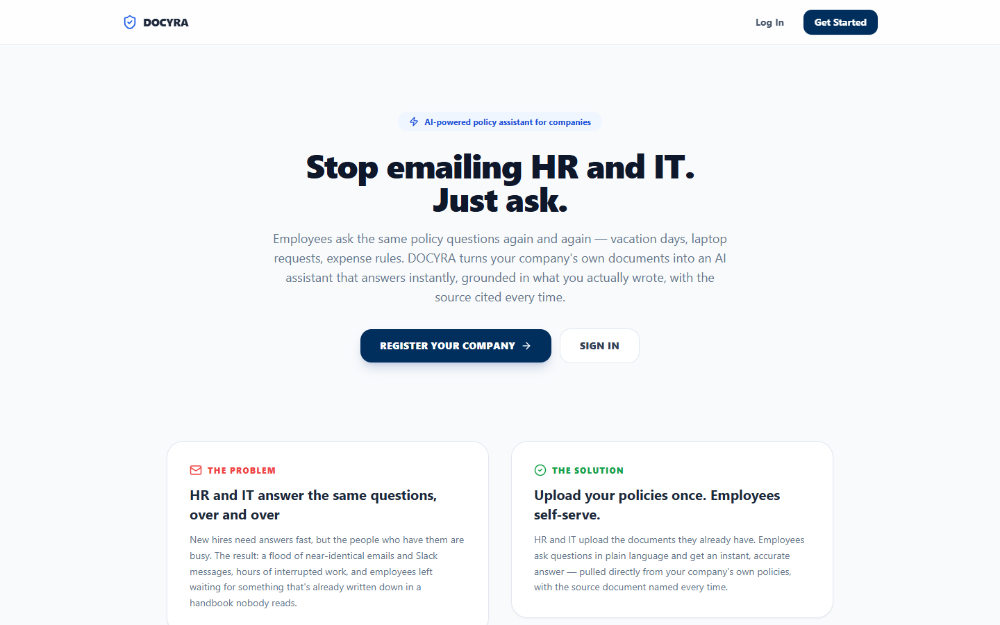
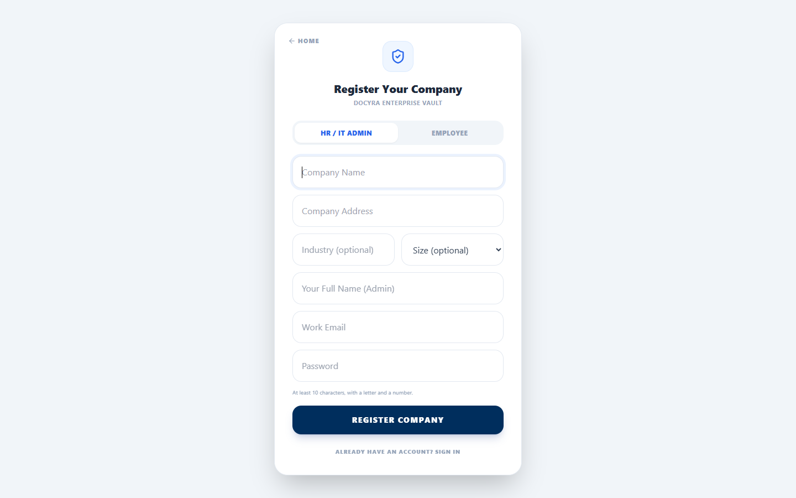
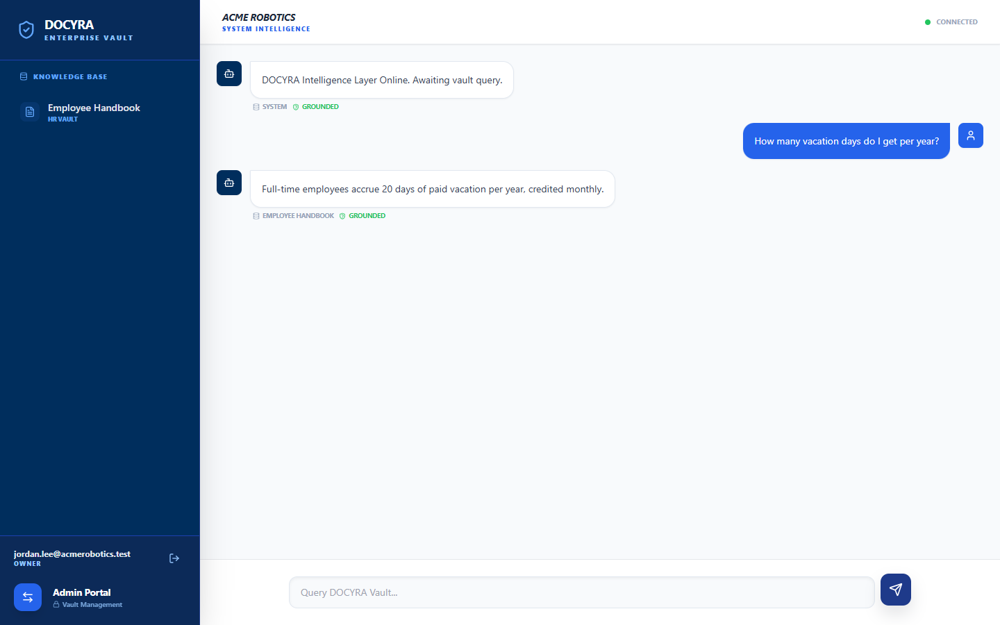
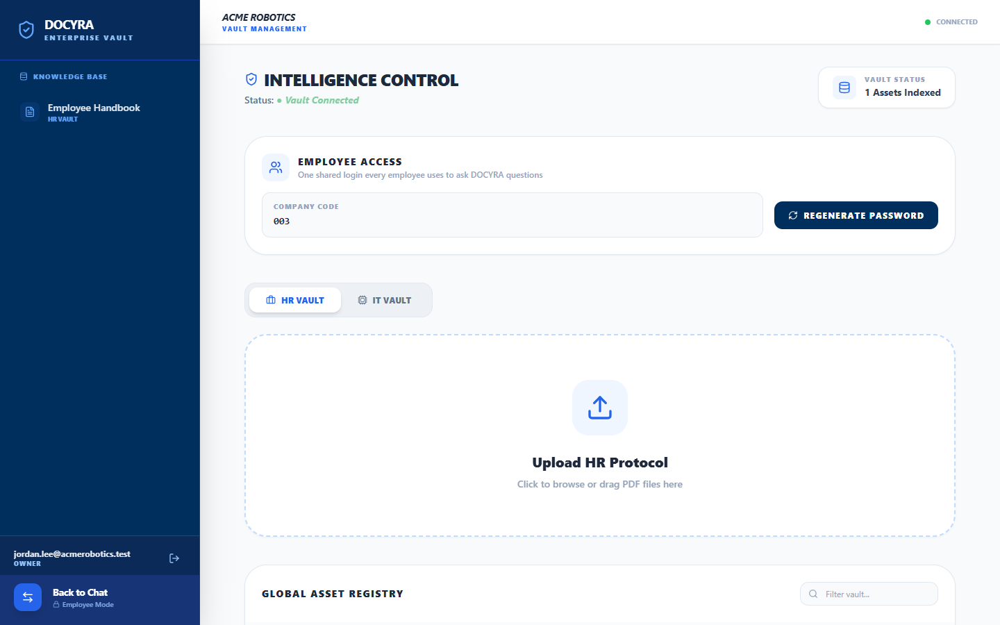

# DOCYRA

**AI-powered internal policy assistant for companies.**

DOCYRA lets employees ask questions about company policies — HR, IT, and beyond — and get instant, accurate answers grounded in the documents a company has actually uploaded, with the source cited every time. It replaces the cycle of employees emailing HR and IT with the same questions over and over.



---

## Table of Contents

- [Overview](#overview)
- [Screenshots](#screenshots)
- [How It Works](#how-it-works)
- [Key Features](#key-features)
- [Architecture](#architecture)
- [Security](#security)
- [Getting Started](#getting-started)
- [Testing](#testing)
- [Project Structure](#project-structure)
- [License](#license)

---

## Overview

**The problem:** New hires and existing employees repeatedly ask HR and IT the same questions — vacation policy, expense rules, laptop requests, remote work eligibility. The answers are usually already written down somewhere, but nobody has time to search for them, so the same question gets asked (and answered) over and over.

**The solution:** A company's HR/IT admin uploads its existing policy documents (PDFs) once. Employees then ask questions in plain language through a chat interface, and DOCYRA answers using **retrieval-augmented generation (RAG)** — the response is generated only from the company's own documents, with the exact source cited, so answers are never hallucinated or made up.

DOCYRA is built as a genuine multi-tenant SaaS platform: every company that registers gets a fully isolated workspace, with its own documents, employee access, and chat history, with no possibility of cross-tenant data access.

## Screenshots

| | |
|---|---|
| **Landing Page** | **Company Registration** |
|  |  |
| **Grounded Chat Answer** | **Admin Panel & Employee Access** |
|  |  |

## How It Works

1. **Register your company** — a business provides its company details and creates an admin (HR/IT) account.
2. **Upload policy documents** — the admin uploads existing PDF policies (HR handbooks, IT guidelines, etc.). Each document is automatically split into chunks and embedded for semantic search.
3. **Share employee access** — every company automatically receives one shared employee login: a company code plus a generated password. Employees don't need individual accounts — they sign in with the shared credential and start asking questions immediately.
4. **Ask, get grounded answers** — an employee asks a question in plain language. DOCYRA retrieves the most relevant document chunks for that specific question, sends only those to the AI model, and returns an answer with the source document cited. If a citation can't be verified against what was actually retrieved, the answer is marked as ungrounded rather than presented as fact.

## Key Features

- **Retrieval-augmented, cited answers** — chunked document embeddings + MongoDB Atlas Vector Search retrieve only the relevant passages per question, rather than sending an entire document library to the model on every message. Every citation is verified against the documents actually retrieved before being shown as "grounded."
- **True multi-tenancy** — every company's documents, chat data, and file storage are strictly isolated by organization. Cross-tenant access is enforced at the database query level and independently verified via automated tests.
- **One login for the whole company** — a single shared, rotatable employee credential (company code + password) removes the need to provision individual employee accounts, while HR/IT admins retain their own named accounts.
- **Enterprise-oriented security** — see the [Security](#security) section below.
- **Zero-cost AI by default** — chat and embeddings run on Google Gemini's free tier; the app degrades gracefully (falling back to a bounded document set) if a vector index or API key isn't configured yet, so it never hard-fails.

## Architecture

| Layer | Technology |
|---|---|
| Frontend | React 19, TypeScript, Vite, Tailwind CSS, GSAP |
| Backend | Express 5, Node.js |
| Database | MongoDB Atlas (Mongoose ODM), Atlas Vector Search |
| File storage | Cloudinary (server-signed, tenant-folder-scoped uploads) |
| AI / LLM | Google Gemini — chat completion and text embeddings |
| Auth | JWT in an httpOnly cookie, role-based access (`owner` / `admin` / `member`) |
| Logging | Structured JSON logs (pino) with request IDs and org/user context |
| Testing | Vitest, Supertest, an in-memory MongoDB replica set |
| CI | GitHub Actions — lint, typecheck, test, and build on every push |

**Retrieval pipeline:** on upload, a document's text is split into overlapping chunks and embedded. On chat, the employee's question is embedded and matched against that organization's chunks via Atlas Vector Search; only the top-matching chunks are sent to the model, keeping answers relevant and cost proportional to the question — not to the size of the document library.

## Security

Security was treated as a first-class requirement throughout, not an afterthought:

- **Strict tenant isolation** — every database query, file upload, and chat request is scoped by organization ID. Cloudinary uploads are folder-scoped per organization and the upload path is independently verified server-side, closing off cross-tenant file access.
- **Sequential, collision-proof company codes** — each organization's employee access code is generated via an atomic database counter, backed by a unique index. Two companies can never receive the same code, even under concurrent registrations.
- **Account lockout** — accounts are temporarily locked after repeated failed login attempts, in addition to IP-based rate limiting, mitigating credential-stuffing attacks distributed across many IPs.
- **Strong password requirements** — admin passwords require a minimum length and a mix of letters and numbers; the shared employee credential uses a high-entropy generated passphrase.
- **JWT session revocation** — sessions are invalidated server-side on password change or credential rotation, not just left to expire.
- **Rate limiting** — per-IP and per-organization limits on authentication, chat, and upload endpoints prevent abuse and cost overruns.
- **Hardened HTTP layer** — Helmet-managed security headers, a strict Content-Security-Policy, CORS allow-listing, and `SameSite=strict` cookies in production.
- **Citation verification** — the AI model's self-reported source citation is cross-checked against the documents actually retrieved for that query before an answer is presented as "grounded," preventing confidently-stated but unverified claims.
- **No secrets in source control** — all credentials are supplied via environment variables and `.env` is git-ignored; see [Getting Started](#getting-started).
- **Automated security-relevant test coverage** — tenant isolation, role-based authorization, JWT revocation, and the full upload-to-chat pipeline are all covered by integration tests that run against a real database on every change.

## Getting Started

### Prerequisites

All required services have a free tier — DOCYRA can be run at zero cost.

- Node.js 20+
- A [MongoDB Atlas](https://www.mongodb.com/atlas) cluster (free tier)
- A [Cloudinary](https://cloudinary.com/) account (free tier)
- A [Google AI Studio](https://aistudio.google.com/apikey) API key for Gemini (free tier)

### Setup

1. Clone the repository and install dependencies:
   ```bash
   git clone https://github.com/muhammadhassan-web/Docyra-AI-Powered-PDF-Search-Platform.git
   cd Docyra-AI-Powered-PDF-Search-Platform
   npm install
   ```

2. Copy `.env.example` to `.env` and fill in your own values:
   - `MONGODB_URI` — your Atlas connection string (must be a replica-set cluster; required for both transactions and Vector Search)
   - `JWT_SECRET` — a long random string, e.g. `openssl rand -base64 48`
   - `CORS_ORIGIN` — the frontend origin (`http://localhost:5173` for local development)
   - `CLOUDINARY_*` — from your Cloudinary dashboard
   - `GEMINI_API_KEY` — from Google AI Studio

3. Run the API and the frontend (two terminals):
   ```bash
   npm run server
   npm run dev
   ```

4. Open the app. Click **Get Started** to register the first company — this account becomes the workspace `owner`. Registration also generates a shared **Employee Access** code and password, shown once — share it with employees so they can sign in under the "Employee" tab. Admins can regenerate that password at any time from the Admin Panel.

5. Once `GEMINI_API_KEY` is set and at least one document has been uploaded, create the Atlas Vector Search index (idempotent, safe to re-run):
   ```bash
   npm run setup:vector-index
   ```
   Atlas builds the index asynchronously — chat keeps working on a graceful fallback path until it's ready.

## Testing

```bash
npm test
```

Runs the full unit and integration suite, including tests that spin up an in-memory MongoDB replica set and exercise the complete HTTP layer: tenant isolation, role-based authorization, JWT revocation, account lockout, and the full upload-to-chat pipeline.

On memory-constrained machines, run with a single worker if the default pool runs out of memory:
```bash
npx vitest run --pool=forks --poolOptions.forks.maxForks=1
```

CI (`.github/workflows/ci.yml`) runs lint, typecheck, tests, and a production build on every push and pull request.

## Project Structure

```
├── server/                # Express API
│   ├── config/             # Environment validation, DB connection
│   ├── middleware/          # Auth, error handling
│   ├── models/               # Mongoose schemas
│   ├── routes/                # API route handlers + integration tests
│   ├── scripts/                # One-off ops scripts (vector index setup)
│   ├── utils/                   # Chunking, embeddings, retrieval, logging, etc.
│   └── workers/                  # Worker-thread PDF parsing
├── src/                    # React frontend
│   ├── api/                 # Typed API client
│   ├── components/           # UI components
│   ├── context/                # Auth context/provider
│   ├── hooks/                    # Reusable animation hooks
│   └── types.ts                    # Shared TypeScript types
├── docs/screenshots/       # README screenshots
└── .github/workflows/      # CI pipeline
```

## License

This project is proprietary. All rights reserved.
